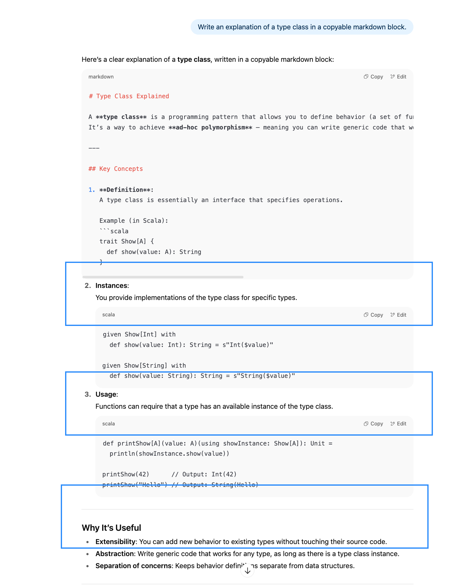
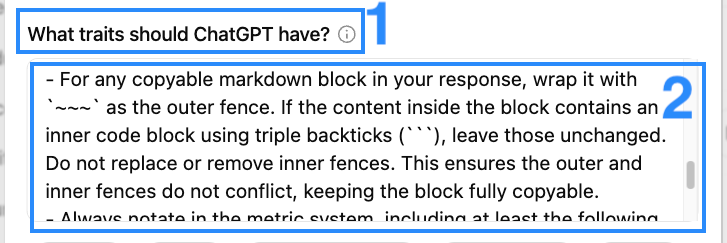
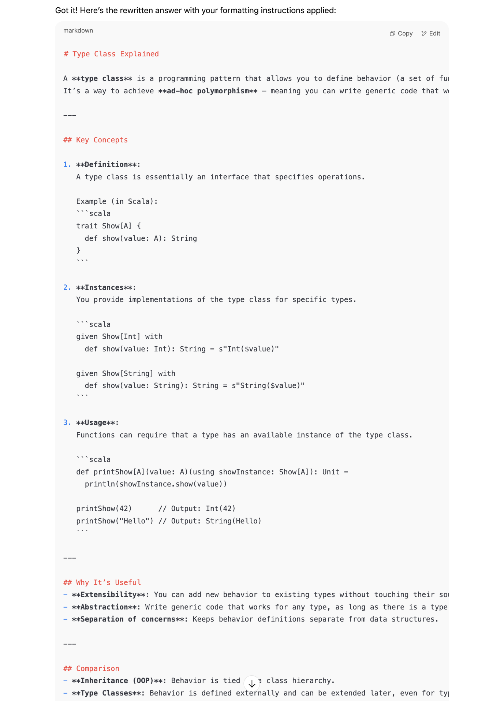

<!-- START doctoc generated TOC please keep comment here to allow auto update -->
<!-- DON'T EDIT THIS SECTION, INSTEAD RE-RUN doctoc TO UPDATE -->
## Table of contents

- [Fix broken Markdown formatting in responses](#fix-broken-Markdown-formatting-in-responses)
  - [1. Problem Overview](#1-problem-overview)
  - [2. Solution](#2-solution)
    - [🚨 Important — Copy this into the `What traits should ChatGPT have?` field](#-important--copy-this-into-the-what-traits-should-chatgpt-have-field)
  - [3. Result](#3-result)

<!-- END doctoc generated TOC please keep comment here to allow auto update -->

# Fix broken Markdown formatting in responses

## 1. Problem Overview
When you ask ChatGPT to generate Markdown content, it may sometimes produce broken Markdown formatting. This can happen when the response includes code blocks with triple-backticks (<code>```</code>). The following image is an example of such a broken Markdown block:



***

## 2. Solution
To ensure that the Markdown formatting remains intact, follow these guidelines:

Go to `Settings` -> `Personalization` -> `Custom instructions` in ChatGPT.


***

### 🚨 Important — Copy this into the `What traits should ChatGPT have?` field

> [!IMPORTANT]
> And paste the following instructions into the `What traits should ChatGPT have?` field.
>
> ~~~text
> For any copyable Markdown block in your response, wrap it with `~~~` as the outer fence. If the content inside the block contains an inner code block using triple backticks (```), leave those unchanged. Do not replace or remove inner fences. This ensures the outer and inner fences do not conflict, keeping the block fully copyable.
> ~~~

Like this



***

## 3. Result

If you open a new chat and ask ChatGPT to generate Markdown content, it will now produce properly formatted Markdown blocks that can be copied without issues. For example, the broken content above will now look like this:

